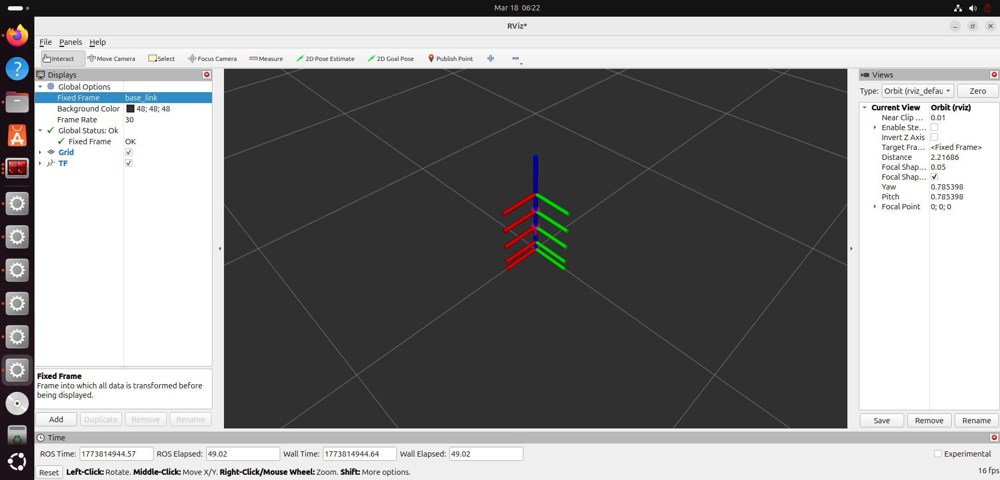
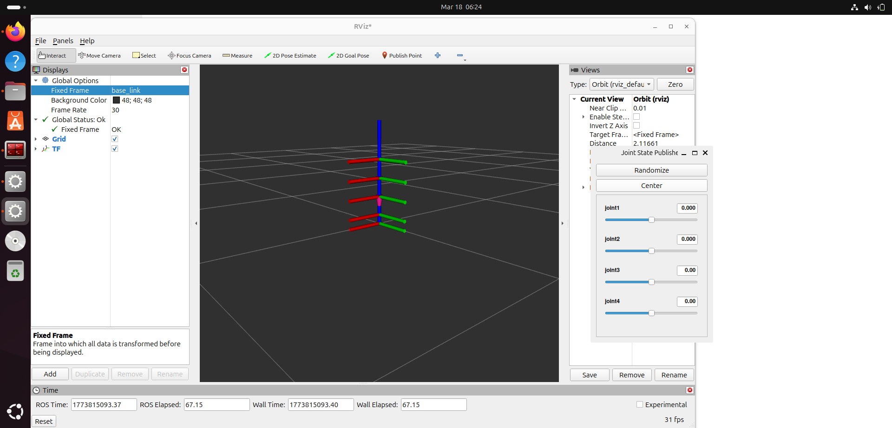

[7:10 am, 18/3/2026] Divya: # ROS2 Robotic Arm (TF + URDF Visualization)

## Overview
This project demonstrates a 4-DOF robotic arm built using URDF and visualized in RViz using ROS2.  
The focus is on understanding coordinate frame transformations using TF2 and how joints are connected in a robotic system.

---

## Tech Stack
- ROS2 (jazzy)
- URDF
- TF2
- RViz

---

## Features
- 4-DOF robotic arm model
- URDF-based robot description
- Real-time TF frame visualization
- Joint state manipulation
- RViz visualization

---

## Output

### Robot Motion


### TF Visualization


---

## How to Run

```bash
cd ~/ros2_ws
colcon build
source install/setup.bash
ros2 launch dof4_arm_description display.launch.py

## Notes
- Robot mesh (.stl) files are sourced from open-source resources and used for visualization purposes.
